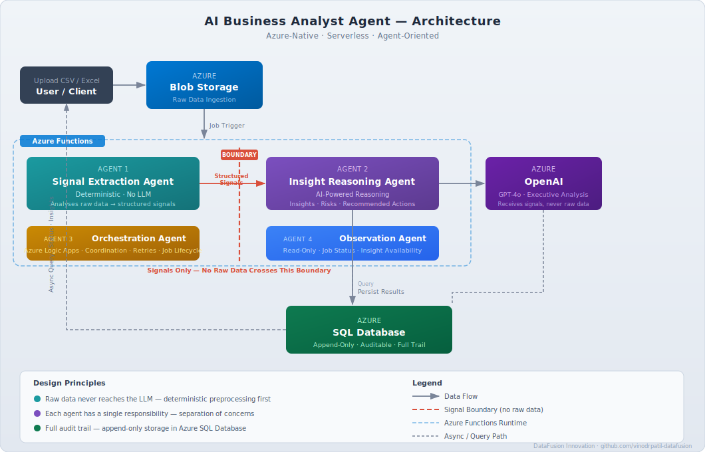

# AI Business Analyst Agent

A serverless, Azure-native reference implementation that turns structured
business data (CSV / Excel) into executive-level insights, risks, and
recommended actions — built on a **deterministic-before-probabilistic**
design so the language model narrates pre-computed facts rather than
calculating them.

> **Status:** Working reference implementation and portfolio build.
> The core pipeline runs end-to-end. It is **not** production-deployed,
> and parts of the design described under *Roadmap* are not yet built.

---

## The core idea

Dashboards show metrics; they rarely answer *"what should I do next?"*
This project does — but with a deliberate guardrail for regulated and
data-sensitive contexts:

> **Raw data is never sent to the LLM.** Statistics and anomalies are
> computed deterministically first; the model receives a bounded,
> pre-computed summary and narrates insight from it. It does not see the
> dataset and does not do the arithmetic.

This is the design's main point of differentiation: the numbers are
trustworthy because they are computed in code, and the LLM is constrained
to interpretation only.

---

## What actually runs today

The pipeline is an HTTP flow over Azure Functions (.NET 8, isolated worker):

1. **`POST /api/jobs`** — registers a job for a previously uploaded blob
   and returns a `JobId`. The caller sends a blob reference, not raw data.
2. **`POST /api/jobs/{jobId}/process`** — runs the pipeline for that job.
3. **`GET /api/jobs/{jobId}`** — returns job status and insight
   availability (read-only).
4. **`GET /api/jobs/{jobId}/insights`** — returns the generated
   `BusinessInsightsV1` for the job (read-only); `404` until insights exist.

Processing (step 2) executes three stages:

- **Signal Extraction (deterministic)** — reads the blob and parses CSV
  (RFC 4180-style: quoted fields, embedded delimiters and newlines) or
  Excel, infers column types, computes per-column statistics, and detects
  anomalies. Numeric parsing routes through a single shared parser, so type
  inference and statistics apply identical, explicit culture rules. Output
  is a structured `BusinessSignalsV1` contract; no raw rows leave this stage.
- **Signal Summarization (deterministic)** — reduces the full signal set to
  a bounded summary sized for the model, so prompt size stays controlled.
- **Insight Reasoning (Azure OpenAI)** — sends the bounded summary to the
  model and parses a structured JSON response into `BusinessInsightsV1`.
  Includes adaptive output-token sizing, token-usage capture
  (input / output / total), and typed error handling.

### Reliability characteristics (implemented)

The processing function is built to be safe to call repeatedly:

- **Idempotency** — a completed job returns `409 Conflict` rather than
  re-running.
- **Concurrency-safe state transition** — `Pending → Processing` is guarded
  so two callers cannot process the same job at once.
- **Timeout safeguard** — processing is bounded by a 90-second linked
  cancellation token.
- **Explicit, retryable failure state** — any exception transitions the job
  to `Failed`. A `Failed` job can be reprocessed (bounded by a retry cap), and
  signals and insights are persisted append-only as one row per attempt, so a
  retry never collides with a prior attempt and every attempt is preserved.

### Security and authentication (implemented)

The application holds no secrets in configuration. It authenticates to all
of its resources through a **user-assigned managed identity** using Entra
(Azure AD) tokens:

- **Azure OpenAI**, **Blob Storage**, and **SQL** are all accessed via the
  managed identity — no API keys or connection-string credentials in app
  settings.
- **Least-privilege RBAC**: *Cognitive Services OpenAI User* on the model
  resource, *Storage Blob Data Reader* (read-only — the app only reads
  uploads) on storage, and scoped `db_datareader` / `db_datawriter` on SQL.
- Locally, the same code falls back to developer sign-in (`az login` /
  Visual Studio), so no secrets are needed for development either.

> The only remaining connection string is the Azure Functions host's own
> platform storage (`AzureWebJobsStorage`), which is required by the runtime
> and is separate from the application's data-plane access.

---

## Architecture

| Layer | Responsibility |
|-------|----------------|
| `src/Contracts` | Versioned (`*V1`) contracts shared across stages |
| `src/FunctionApp` | Azure Functions: parsing, deterministic analysis, agents, persistence |
| `database/` | SQL schema for jobs, signals, and insights |
| `docs/` | Architecture, design decisions, responsible-AI notes |
| `samples/` | Sample input datasets |

**Stack:** Azure Functions (Consumption) · Azure OpenAI · Azure Blob
Storage · SQL database · Entra / Managed Identity auth · GitHub Actions
(CI/CD with OIDC federated identity).

---

## Scope and current limitations

This is a focused reference build, scoped deliberately to the
deterministic-to-probabilistic handoff. Known boundaries:

- **Orchestration is manual.** The submit → process flow is triggered by
  explicit HTTP calls; there is no automated orchestrator yet (see *Roadmap*).
  Failed jobs are reprocessable, but reprocessing is a manual re-call, and
  there is no automatic retry/backoff on transient model-call failures.
- **Numeric parsing assumes invariant format.** Type inference and
  statistics share a single explicit culture (InvariantCulture); values in
  other locale formats (e.g. comma decimals) are rejected rather than
  silently misinterpreted. Locale-configurable parsing is on the roadmap.
- **No automated test suite yet.** See *Roadmap*.

These are tracked, not hidden — the design is honest about what it does and
does not yet guarantee.

---

## Roadmap

Planned, not yet implemented:

- **Automated orchestration** (e.g. a queue trigger or durable orchestrator)
  to replace the manual process trigger, with lifecycle handling.
- **Resilience on model calls** — retry with exponential backoff for
  transient Azure OpenAI failures (e.g. rate limiting).
- **Test suite** — deterministic unit tests for parsing, type inference,
  statistics, and anomaly detection (locking in the CSV quoted-field and
  numeric-culture handling), plus contract-compatibility tests.
- **Locale-configurable numeric parsing** — optional culture selection
  beyond the invariant default.
- **Expanded sample datasets and deployment instructions.**

---

## Responsible-AI posture

- Deterministic preprocessing precedes all AI reasoning.
- No raw data is sent to the model — only a bounded, pre-computed summary.
- Structured prompts and structured-JSON parsing constrain model output.
- Signals and insights are persisted for auditability.
- Contracts are versioned for backward compatibility.
- Resource access is secretless — managed identity with least-privilege RBAC.

See `docs/responsible-ai.md` for detail.

---

## Author

**Vinod Patil** — Lead Data & AI Engineer

[LinkedIn](https://www.linkedin.com/in/vinodrpatil/) ·
[GitHub](https://github.com/vinodrpatil-datafusion)

Originally built for the Microsoft AI Dev Days Global Hackathon 2026.
